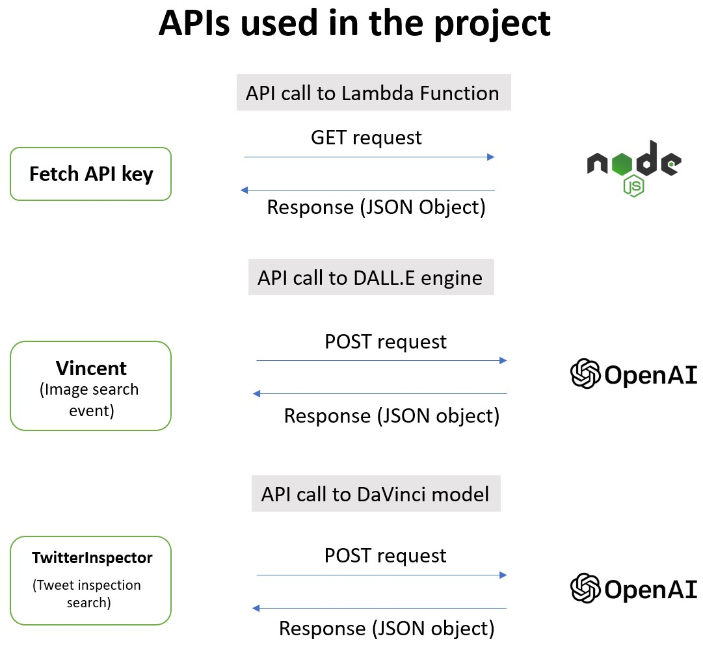
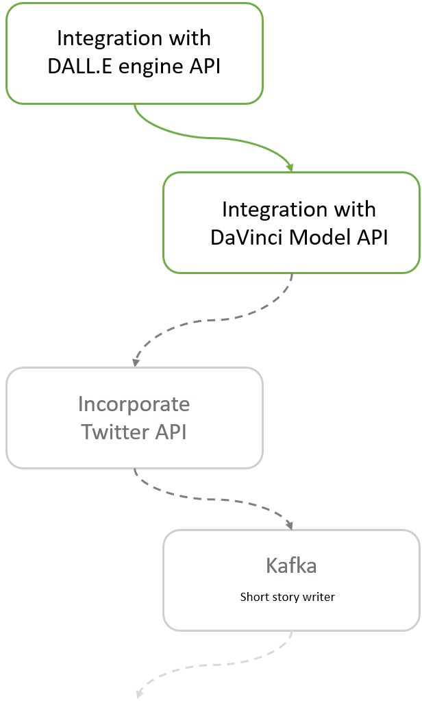
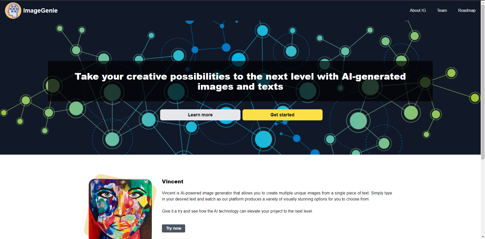
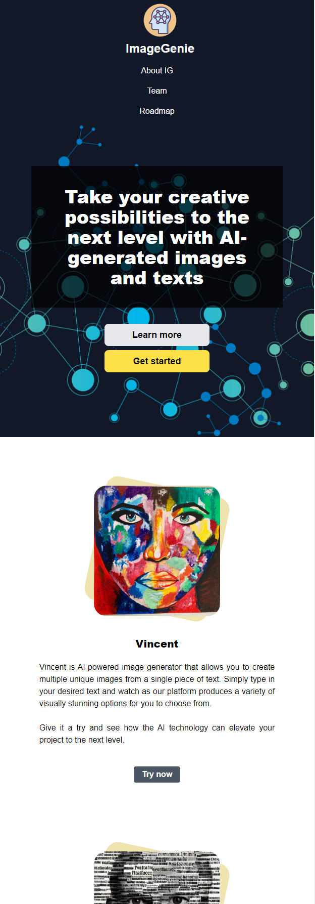

## Authors
Zafar Ahmed, Alyshia Kandler, Callum Mackintosh

# AI Based Content Generator

ImageGenie was created using AI technology which gives you the power to generate an image based off a simple prompt or to screen a tweet for discrimination of any kind.

 # Website address

 Deployed address: https://alyshiak.github.io/ig9863450/

 Github address: https://github.com/alyshiak/ig9863450
 
 
# Techinical details

- APIs

  

# Roadmap

AI is evolving and so is our project. The future roadmap for ImageGenie includes several exciting developments and new features.

## Twitter API
In the near term, we plan to integrate our TwitterInspector with Twitter to provide better user experience. The application for the developers account has been approved and currently our team is working on exploring the ways in which we can incorporate the API into our application.

## Kafka
Kafka is an application that generates short stories with corresponding images. It allows users to input a short description of the story they would like to create, and the application generates a unique, engaging story with corresponding images that bring the narrative to life.

## Improving User interface

Additionally, we aim to make ImageGenie more accessible to a wider range of users by developing a user-friendly and intuitive interface and supporting multiple languages. We believe that by making the application more user-friendly, it will be easier for users to harness the power of AI to generate images and text for a variety of use cases.

  

# Screenshots

- Desptop view

  

- Mobile view

  

